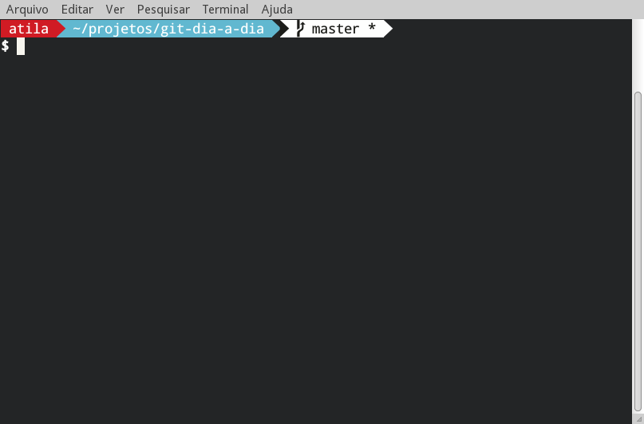

# Git: Dia-a-dia

## Configure git

* set username `git config --global user.name "Your Name"`
* set email `git config --global user.email "you@example.com"`
* set default editor for commit `git config --global core.editor "vim"`
* install git-town, gitg, meld
* set default mergetool `git config --global merge.tool meld`
* git status prompt <https://github.com/twolfson/sexy-bash-prompt>



## Comandos básicos

* init
* clone
* status
* add
* commit
* branch
* checkout
* push
* pull
* merge
* rebase

## Happy Day

Init a project: Homepage do COMSOLiD

```
$ git init --bare homepage.git
$ git clone homepage.git/ homepage-a
```

Alice starts working...

```
$ cd homepage-a
$ touch index.html
$ # edit index.html
```

```html
<!DOCTYPE html>
<html>
    <head>
        <meta charset="utf-8">
        <title>COMSOLiD</title>
    </head>
    <body>

    </body>
</html>
```

```
$ git status
On branch master

Initial commit

Untracked files:
  (use "git add <file>..." to include in what will be committed)

	index.html

nothing added to commit but untracked files present (use "git add" to track)
```

Add and commit

```
$ git add index.html
$ git status
On branch master

Initial commit

Changes to be committed:
  (use "git rm --cached <file>..." to unstage)

	new file:   index.html
```

```
$ git commit
[master (root-commit) 76d6fc3] initial commit.
 1 file changed, 10 insertions(+)
 create mode 100644 index.html
```

```
$ git status
On branch master
Your branch is based on 'origin/master', but the upstream is gone.
  (use "git branch --unset-upstream" to fixup)

nothing to commit, working directory clean
```

```
$ git remote -v
origin	/tmp/homepage.git/ (fetch)
origin	/tmp/homepage.git/ (push)
```

```
$ git push origin master
Counting objects: 3, done.
Delta compression using up to 8 threads.
Compressing objects: 100% (2/2), done.
Writing objects: 100% (3/3), 315 bytes | 0 bytes/s, done.
Total 3 (delta 0), reused 0 (delta 0)
To /tmp/homepage.git/
 * [new branch]      master -> master
```

```
$ git status
On branch master
Your branch is up-to-date with 'origin/master'.

nothing to commit, working directory clean
```

Usuário Bob

```
$ git clone homepage.git/ homepage-b
Cloning into 'homepage-b'...
done.
$ cd homepage-b/
$ ls
index.html
```

## Issues: resolvendo issues em branches

### Bob: 1 - Adicionar Bootstrap a página inicial.

```
$ git checkout -b issue-1
$ # go to work!
```

start a local server

```
$ python -m SimpleHTTPServer
```

Abrir `tarefa-1/index.html`

```
$ gitg
```

errar a mensagem e mostrar uso do `--amend`.

```
$ git commit --amend
$ git reflog
9b0eaf8 HEAD@{0}: commit (amend): Bootstrap adicionado.
75429d4 HEAD@{1}: commit:Bootstrap acionado.
a3c58cd HEAD@{2}: checkout: moving from master to issue-1
a3c58cd HEAD@{3}: clone: from /home/atila/projects/homepage.git/
```

Usar Pull Request para fazer o merge.

* Revisão do código
* Safe merge
* Integração com Continuous Integration (CI)

```
$ git checkout master
$ git merge --no-ff --log issue-1
$ git push origin master
```

### Alice: 2 - Adicionar logos de softwares livres

copy `img` sources to assets

```
$ git checkout -b issue-2
$ # go to work!
$ # commit using gitg
$ git checkout master
$ git merge --no-ff --log issue-2
$ git push origin master
To /home/atila/projects/homepage.git/
 ! [rejected]        master -> master (fetch first)
error: failed to push some refs to '/home/atila/projects/homepage.git/'
hint: Updates were rejected because the remote contains work that you do
hint: not have locally. This is usually caused by another repository pushing
hint: to the same ref. You may want to first integrate the remote changes
hint: (e.g., 'git pull ...') before pushing again.
hint: See the 'Note about fast-forwards' in 'git push --help' for details.
```

mais um motivo para usar PR!

```
$ git fetch --prune
$ git rebase origin/master
$ git push origin master
```

## Git town

__Development Workflow__

* [git hack](/documentation/commands/git-hack.md) - cuts a new up-to-date feature branch off the main branch
* [git sync](/documentation/commands/git-sync.md) - updates the current branch with all ongoing changes
* [git new-pull-request](/documentation/commands/git-new-pull-request.md) - create a new pull request
* [git ship](/documentation/commands/git-ship.md) - delivers a completed feature branch and removes it

### Bob: 3 - Criar seção Distros Linux

```
$ git checkout master
$ git sync
$ git hack issue-3
```

show every step of hack.

__obs__: fazer o hack de Alice antes de commitar!

Abrir `tarefa-3/index.html`

```
$ gitg
Seção de Distribuições GNU/Linux

Fixed #3.
$ git new-pull-request
```

Para o exemplo usar `ship`.

### Alice: 4 - Criar seção Ambientes gráficos

```
$ git checkout master
$ git hack issue-4
```

Abrir `tarefa-4/index.html`

```
$ # add and commit
Seção Ambientes gráficos.

Fixed #4.
$ git ship
...
Mesclagem automática de index.html
CONFLITO (conteúdo): conflito de mesclagem em index.html
Automatic merge failed; fix conflicts and then commit the result.

To abort, run "git ship --abort".
To continue after you have resolved the conflicts, run "git ship --continue".
$ git ship --abort
```

undo the commit

```
$ git log
$ # obter hash do seu commit! algo como 6485209
$ git reset --hard HEAD^
$ git sync
$ git merge 6485209
Mesclagem automática de index.html
CONFLITO (conteúdo): conflito de mesclagem em index.html
Automatic merge failed; fix conflicts and then commit the result.
$ git mergetool
Merging:
index.html

Normal merge conflict for 'index.html':
  {local}: modified file
  {remote}: modified file
```

Fazer o merge das alterações do remoto com as suas locais.

__obs:__ caso esqueça qual o último commit usar comando `git reflog`.

```
$ git commit
[issue-4 188bf6c] Merge commit '6485209' into issue-4
```

Merge commit, sempre é feito após uma resolução de conflitos.

```
$ git ship
```

`git ship` fez `merge --squash`, mas também poderia ser feito com
`git rebase -i master`.

__TODO__ mostrar uso do rebase.
